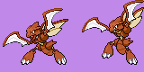
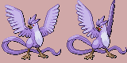
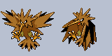

# Invidiually-Unique Pokémon Colors (+ Improved Shiny Colors) for Pokémon Platinum

[(Example video)](https://imgur.com/a/Xb3QwaE)

This Platinum hack aims to make it so each individual Pokémon has a slight color variation based on its personality value. This is inspired by a [similar feature](https://guidesmedia.ign.com/guides/9846/images/pikacolors.jpg) from the Pokémon Stadium games that does just this but based on the Pokémon's nickname. The ROM hack [Pokémon Polished Crystal](https://github.com/Rangi42/polishedcrystal) implements a very similar feature based on IV values. This implementation performs a hue shift on the Pokémon's palette on load.

If you would like to use this in your own hacks, please feel free to do so!

## Improved Shiny Colors

Some Pokémon have shiny colors that are very close to their non-shiny colors, or at least close enough that the simple hue shift performed by this hack may make a normal Pokémon look shiny. To remedy this, many Pokémon have been given revamped shiny colors. In additon, the opportunity has been taken to revamp Pokémon that seem to have obviously "bad" shiny palettes even if there's no ambiguity issue.

List of changed Pokémon (so far):

  

**Pichu, Pikachu, Raichu** - Tried to make visually distinct instead of the slight orange tint. A bit of a gradient from pale yellow to pale orange throughout the evolutionary line.

**Nidoqueen** - Colors made to look like Nidoking, which matches the pattern set by all other members of the Nidoran lines.

 

**Meowth, Persian** - Mint green to complement vanilla shiny Meowth's pink, and with a silver coin and ears, respectively.

 

**Abra, Kadabra** - More pink instead of brown to match, and create a gradient towards, shiny Alakazam.

 

**Seel, Dewgong** - Made to look more visibly gold.

 

**Haunter, Gengar** - Tried to make a sensible gradient from Gastly to Mega Gengar (purple -> white with blue highlights). Normal Gengar has been also modified to be like its [anime palette](https://static.wikia.nocookie.net/pokemon/images/8/8a/Morty_Gengar.png). *(The image data of this sprite has also been tweaked.)*

**Scyther** - Made to be red-orange, which makes shiny Scyther and Scizor effectively be a loose swap of their normal colors.

  

**Elekid, Electabuzz, Electivire** - Light blue, with Elekid being slightly more Cyan. Electivire has gold tips.

 

**Munchlax, Snorlax** - Like a brown bear.

**Articuno** - Lavender.

**Zapdos** - Brown.

 

**Sunkern, Sunflora** - Purple and a more blueish green, resembling a [purple sunflower](https://m.media-amazon.com/images/I/71rqiFQLLiL._AC_SL1203_.jpg).

**Espeon** - Less overly saturated.

**Leafeon** - Fall colors, inspired by [various](https://aminoapps.com/c/shiny-pokemon-amino/page/blog/do-you-wish-shiny-leafeon-and-shiny-glaceon-was-batter/7eJV_e2nUPuEW5ZJBD4wELq7qDGjnMQboM) [posts](https://www.deviantart.com/littlepie95/art/Improved-Shiny-Leafeon-806020174) suggesting the idea.

**Gligar** - Normal Gligar has been changed to its HGSS colors, which are much closer to the official artwork. (No need to change the shiny palette, as this now makes them very distinguished.)

**Magcargo** - Lava part matches shiny Slugma.

 

**Mantyke, Mantine** - Green and aqua-ish scheme, based on [this](https://www.deviantart.com/rayquazaflygon/art/Alt-Shiny-Mantine-711360951) post by RayquazaFlygon.

**Phanphy** - Inverted from its normal palette.

**Smoochum** - Lavender and light-pink body, and platinum blonde hair to match shiny Jynx.

**Magby** - Red-pink and pink to match Magmar and Magmortar's shiny colors.

 

**Happiny, Blissey** - Green and light-gold-tan to match shiny Chansey. *(The image data of this sprite has also been tweaked, including the D/P sprite.)*

**Combusken** - Changed to match the color change made in Sword/Shield.

 

**Loudred, Exploud** - Lime green details instead of yellow to match shiny Whismur.

**Plusle** - Hot pink/magenta.

**Regice** - A deep dark blue, inspired by [this post](https://www.reddit.com/r/MandJTV/comments/ibqj33/shiny_regice_redesign_its_not_much_but_its_better/) by [/u/SmallBigBrainBoi](https://www.reddit.com/user/SmallBigBrainBoi).

  

**Piplup, Prinplup, Empoleon** - Based off of [this post](https://imgur.com/t/shinypokemon/LMnl0Jx) from cjgart2000. Intended to give the "emporer penguin" look.

 

**Gabite, Garchomp** - Tried to make them consistent with shiny Gible (deeper blue, yellow/orange belly).

 

**Snover, Abomasnow** - Extremeties made a deeper blue to make the worst case between normal and shiny less ambiguous.

**Dusknoir** - Red to match shiny Duskull and Dusclops.

**Froslass** - A rose/sakura body with a violet belt/bow.

 

**Phione, Manaphy** - Purplish-blue body, cyan eyelashes for Manaphy, purple gem. Based on [this post](https://www.deviantart.com/epicgordoman/art/Shiny-Manaphy-747110225) by EpicGordoMan.

## Building

1. Install [devkitARM](https://devkitpro.org/wiki/Getting_Started).
2. Install a [D compiler](https://dlang.org/download.html).
3. Download [PokEditor v1](https://github.com/turtleisaac/PokEditor/releases), extract it into the root folder of this repo, and rename folder that got extracted to `PokEditor`.
4. Use a program like Nitro Explorer 3 to extract `arm9.bin`, `overlay9-5.bin`, `overlay9-12.bin`, `overlay9-16.bin`, `overlay9-86.bin`, and `overlay9-87.bin`, and `data/weather_sys.narc` from your Platinum ROM.
5. Place them in the root folder of this repo, and name them to `arm9_vanilla.bin`, `overlay5_vanilla.bin`, `overlay12_vanilla.bin`, `overlay16_vanilla.bin`, `overlay86_vanilla.bin`, `overlay87_vanilla.bin`, and `weather_sys.narc`, respectively.
6. Use Tinke or PokEditor v2 (not v1) to extract file 65 from `weather_sys.narc` as `weather_sys_065_vanilla.bin`.
7. Run `./build.sh`.
8. Overwrite file 65 from `weather_sys.narc` with `weather_sys_065_patched.bin` (in Tinke, don't forget to select the narc filename and hit "Pack").
9. Inject `arm9_patched.bin`, `overlay5_patched.bin` `overlay12_patched.bin`, `overlay86_patched.bin`, `overlay87_patched.bin`, and `weather_sys.narc` back into `arm9.bin`, `overlay9-5.bin`, `overlay9-12.bin`, `overlay9-16.bin`, `overlay9-86.bin`, `overlay9-87.bin`, and `data/weather_sys.narc`, respectively.
10. Extract `poketool/pokegra/pl_pokegra.narc`.
11. For each image in the `ShinyChanges` folder, insert that image to the proper place using "Pokemon Ds/Pic Platinum". (Note that some Pokémon might have changes to the base sprite.)
12. Reinsert `pl_pokegra.narc`.
13. If you want to be really thorough, extract `poketool/pokegra/pokegra.narc` and replace each changed palette entry (only the palette ones, not the image ones, unless necessary like Blissey!).
14. Extract `data/mmodel/mmodel.narc` as `ow_sprites.narc`.
15. Run `./pack_follow_pal.sh`.
16. Insert the resulting `ow_sprites_patched.narc` to `data/mmodel/mmodel.narc`.

## How It Works

As stated, each Pokémon has its palette hue shifted by an amount determined by their personality value. To be more precise, the hue shift is currently coded to be within +/- 20 degrees, and the third personality byte, masked with `0x3F`, is used to determine it, meaning there are 64 possible steps within that range. (Though, it should be noted values `0x00` and `0x20` both mean "no shift", and realistically, the steps are granular enough to the point where two adjacent values may end up producing the same color. So, it's effectively less than 64.)

The added code used to make this work are inserted in `arm9.bin` at `0x5003C` through `0x50414`, as this I'm told this range (and up until `0x507E4`) is unused by the game. I also use this space as free RAM when needed, also. A quick layout:

| Address      | Description                                                                                                                                                                                                    |
|--------------|----------------------------------------------------------------------------------------------------------------------------------------------------------------------------------------------------------------|
| `0x020501E0` | Personality value of player Pokémon 1 (and the OW following Pokémon)                                                                                                                                         |
| `0x020501E4` | Personality value of enemy Pokémon 1                                                                                                                                                                           |
| `0x020501E8` | Personality value of player/partner Pokémon 2                                                                                                                                                                  |
| `0x020501EC` | Personality value of enemy Pokémon 2                                                                                                                                                                           |
| `0x020501F0` | Saved-off variable battle data pointer                                                                                                                                                                         |
| `0x020501F4` | Unused                                                                                                                                                                                                         |
| `0x020501F8` | `0xBA771E` if currently in battle, something else otherwise. Set by `Hijack_BattleStart`, `Hijack_BattleEnd`, `Hijack_BattleEndCaught`. Read by `Hijack_HueShift.s`; `0xF0110` if a OW following sprite is going to be loaded. Set by `Hijack_WalkingPokemonDetect2.s`, read by `Hijack_WalkingPokemon.s`.                                          |
| `0x020501FC` | Read in `Hijack_GbaPal.s` to determine if up the call chain, it was signalled that a Pokémon's battle sprite palette is being loaded. `0xBEEFXXXX` where `XXXX` is the index of the sprite being loaded (0-3). Also set to `0xFA3E` when loading a sprite for the Hall of Fame, to be read in `Hijack_PaletteUpload.s`; `0x0E66` when loading the egg hatching animation graphics, to be read by `Hijack_AnimPal.s`. |
| `0x02050200` | Contains the personality value of the Pokémon read by the last call to `GetPkmnData` or `GetBoxPkmnData`, read by `Hijack_HueShift.s` and `Hijack_MiscSprite.s`.                                             |

A rundown of the code files involved:

* `hueshift.c` - Contains the function that performs a hue shift on a given palette by a value (limited through a mask with `0x3F`). The method for hue shifting was taken from [this StackOverflow post](https://stackoverflow.com/a/8510751/963007) but adapted to do it in fixed point since the DS does not have a floating point unit. Instead of trying to run sin/cos functions directly, I generate two tables (see `tableprinter.d`) of precomputed sin/cos values in the fixed point format I wanted. Values `0x00` through `0x1F` shift positively, while `0x20` through `0x3F` shift negatively.

* `Hijack_PersonalitySave.s` - This code is jumped to from hijacks in both [GetPkmnData](https://github.com/KernelEquinox/PokePlatinum/blob/d4ceb51ccbd9dadd4578afac084d207b3a2a244a/pokemon_data.c#L517) and [GetBoxPkmnData](https://github.com/KernelEquinox/PokePlatinum/blob/d4ceb51ccbd9dadd4578afac084d207b3a2a244a/pokemon_data.c#L612). It just grabs the personality value of the Pokémon involved in this function call (stored conveniently as the first thing in the data block pointed to by `r0`) and puts it at `0x02050200` to be used by `Hijack_HueShift.s`.

* `Hijack_HueShift.s` - Hijacks right during a palette load for most instances of a Pokémon's sprite. *Most* of the time, Pokémon sprites are drawn as a textured polygon for the squash/stretch effect for when they're animated. Outside of battle, the personality value used is stored at `0x02050200`. The hope here is that whatever the last call to `GetPkmnData` or `GetBoxPkmnData` prior to this code being reached was for the Pokémon we're loading the palette for. However, this is not necessarily true during a battle, and in that case, it will read from the personality table at `0x020501E0` (see `Hijack_PersonalityTableBuild2.s`). The code in `hueshift.c` is then called to achieve the hue shift effect.

* `Hijack_PersonalityClearPokedex.s` - Hijack in [some function](https://github.com/KernelEquinox/PokePlatinum/blob/d4ceb51ccbd9dadd4578afac084d207b3a2a244a/pokedex.c#L1518) that appears to always be called when entering the Pokédex. This sets `0x02050200` to `0` so that Pokémon viewed from the Pokédex don't have any hue shift applied to them.

* `Hijack_BattleDataPtrSave.s` - This hijacks a function in [overlay 16 ("Battle Interface")](https://github.com/KernelEquinox/PokePlatinum/blob/master/Battle/016_BattleInterface.c) called `GetMainBattleData_GetAdrOfPkmnInParty`. It stores a pointer stored passed in `r0` relating to varialbe battle data to `0x020501F0` so that it can be used in `Hijack_PersonalityTableBuild.s`. (Note: This very probably could have been achieved by hijacking a different place instead, but this still works.)

* `Hijack_BattleStart` - Hijacks the `0` case of the switch in `BattleEngineInit` in [overlay 16](https://github.com/KernelEquinox/PokePlatinum/blob/master/Battle/016_BattleInterface.c) (right when a battle starts). Stores `0xBA771E` into `0x020501F8` to be read later by `Hijack_HueShift.s`.

* `Hijack_BattleEnd` - Hijacks the `9` case of the switch in `BattleEngineInit` in [overlay 16](https://github.com/KernelEquinox/PokePlatinum/blob/master/Battle/016_BattleInterface.c) (right when a battle ends). Stores `0` into `0x020501F8` to be read later by `Hijack_HueShift.s`.

* `Hijack_BattleEndCaught` - Hijacks in `TryToCatchPkmn` in [overlay 16](https://github.com/KernelEquinox/PokePlatinum/blob/master/Battle/016_BattleInterface.c) when a Pokémon is caught. Stores `0` into `0x020501F8` to be read later by `Hijack_HueShift.s`. This prevents the sprites loaded during the post-capture sequence from using the in-battle personality table, since they always use the 0th sprite slot.

* `Hijack_PersonalityTableBuild.s` - Hijacks inside a [function in overlay 12 ("Move Animations")](https://github.com/KernelEquinox/PokePlatinum/blob/d4ceb51ccbd9dadd4578afac084d207b3a2a244a/Battle/012_MoveAnimations.c#L4753) that gets called whenever a Pokémon is being switched out. In battles, not only do Pokémon load the typical textured polygon sprite, but during various battle animations, a GBA-styled tile-based sprite that looks just like the other one is placed on top of it. To account for this, I had to do a lot more work to figure out which Pokémon's sprite is being loaded. My code is ran in the middle of a loop from 0 to 3 (one for each Pokémon that could be on the field). I have to use this current index to read into a table describing which Pokémon are actually on the field at the moment (can be 0-5), call `GetMainBattleData_GetAdrOfPkmnInParty` to grab the pointer to that Pokémon in whatever party it's in, get the personality value, then store it off in my table at `0x020501E0` so it can be read later. (Note: The meaning of the loop indices 0-3 is the same as in the free RAM table above).

* `Hijack_PersonalityTableBuild2.s` - Hijacks inside `AllocInitMainBattleData` in [overlay 16](https://github.com/KernelEquinox/PokePlatinum/blob/master/Battle/016_BattleInterface.c); when a battle begins, right after all the data is loaded. Basically the same as `Hijack_PersonalityTableBuild.s`, but it does a loop over active Pokémon indices 0-3 itself.

* `Hijack_BattleSprite.s` - Hijacked in the [same function](https://github.com/KernelEquinox/PokePlatinum/blob/d4ceb51ccbd9dadd4578afac084d207b3a2a244a/Battle/012_MoveAnimations.c#L4873) `Hijack_PersonalityTableBuild.s`, reached soon after it if the current loop index is for a Pokémon who needs to load its alternate sprite during the switchout animation. Stores `0xBEEFXXXX` where `XXXX` is the current loop index at `0x020501FC` so it can be read by `Hijack_GbaPal.s`.

* `Hijack_BattleSprite2.s` - Reached [during move animations](https://github.com/KernelEquinox/PokePlatinum/blob/d4ceb51ccbd9dadd4578afac084d207b3a2a244a/Battle/012_MoveAnimations.c#L2374). Does basically the same thing as `Hijack_BattleSprite.s`.

* `Hijack_GbaPal.s` - Reached from down the call chain (in `Function_2002fec`) after `Hijack_BattleSprite.s` or `Hijack_BattleSprite2.s`. Reads `0x020501FC`, looking for `0xBEEF` to determine whether this is a Pokémon's palette being loaded. If so, it uses the current battle sprite ID to index into the personality value table at `0x020501E0` and then use it to call the code in `hueshift.c`. `0x020501FC` is then set to `0` so to ensure that this code won't run again unless this is for a Pokémon sprite.

* `Hijack_MiscSprite.s` - Hijacks inside a function used for loading the palette for Pokémon sprites in miscellaneous circumstances, like during the HM use animation and in the introduction when Professor Rowan sends out a Pokémon. Loads the personality value at `0x02050200` and calls the code at `hueshift.c`.

* `Hijack_HallOfFame.s` - Hijacks functions in [overlay 86](https://github.com/KernelEquinox/PokePlatinum/blob/d4ceb51ccbd9dadd4578afac084d207b3a2a244a/Misc/086_HallOfFamePokemonEntry.c#L584) and [overlay 87](https://github.com/KernelEquinox/PokePlatinum/blob/d4ceb51ccbd9dadd4578afac084d207b3a2a244a/Misc/087_HallOfFamePC.c#L825) that are about to call `Call_LoadFromNARC_RLCN` to load Pokémon palettes during viewing the Hall of Fame (actual location and in the PC, respectively). Sets `0x020501FC` to `0xFA3E` so it can be read down the call chain by `Hijack_PaletteUpload.s`.

* `Hijack_PaletteUpload.s` - Hijacks in a common function that uploads palettes to the palette RAM. Checks if `0x020501FC` was set to `0xFA3E` earlier in the call chain - if so, loads the personality value at `0x02050200`, calls the code at `hueshift.c`, then resets `0x020501FC` to `0`.

* `Hijack_EggHatching.s` - Hijacks in overlay 119, right before a [function call](https://github.com/KernelEquinox/PokePlatinum/blob/d4ceb51ccbd9dadd4578afac084d207b3a2a244a/Misc/119_EggHatch.c#L505) to load the palette for the egg hatching animation. Sets `0x020501FC` to `0x0E66` to be read further down the call chain by `Hijack_AnimPal.s`.

* `Hijack_AnimPal.s` - Hijacks a common function related to loading palettes (unsure of its exact purpose), just before uploading to palette RAM occurs. Checks if `0x020501FC` was set to `0x0E66` earlier in the call chain - if so, loads the personality value at `0x02050200`, calls the code at `hueshift.c`, then resets `0x020501FC` to `0`.

* `Hijack_WalkingPokemonDetect.s` - Hijacks a function in overlay 5 called when the overworld sprites are about to load during an OW load (e.g. entering/exiting a door, closing a fullscreen menu). `0x000F0110` is set to `0x020501F8` to be used by `Hijack_WalkingPokemon.s` later.

* `Hijack_WalkingPokemonDetect2.s` - Hijacks three places in Following Platinum's synthetic overlay (`data/weather_sys.narc`, file 65) where a Pokémon's species is about to be determined for loading its proper sprite. The personality value of the Pokémon being considered is saved to `0x020501E0` to be used by `Hijack_WalkingPokemon.s` later. (Unfortunately, by the time `Hijack_WalkingPokemon.s` is hit, the last-read Pokémon's personality value can't be used because of some other code that gets called between `Hijack_WalkingPokemonDetect.s` and it.)

* `Hijack_WalkingPokemon.s` - Hijacks two places in overlay 5, right at the point the BTX file for an overworld sprite gets loaded from `data/mmodel/mmodel.narc`. The overwritten call to load the BTX is ran. Then, if the file ID being read from the narc is one of the following Pokémon sprites (471-1324), and `0x020501F8` was set to `0x000F0110` earlier, we call the code at `hueshift.c` using the personality value in `0x020501E0` on both the normal and shiny palettes in the BTX file. `0x020501F8` is set to `0`.

## Credits

* [MKHT](https://twitter.com/mkht_real) - Lots of help choosing shiny colors.
