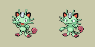
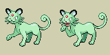
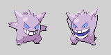

# Invidiually-Unique Pokémon Colors (+ Improved Shiny Colors) for Pokémon Platinum

This Platinum hack aims to make it so each individual Pokémon has a slight color variation based on its personality value. This is inspired by a [similar feature](https://guidesmedia.ign.com/guides/9846/images/pikacolors.jpg) from the Pokémon Stadium games that does just this but based on the Pokémon's nickname. The ROM hack [Pokémon Polished Crystal](https://github.com/Rangi42/polishedcrystal) implements a very similar feature based on IV values. This implementation performs a hue shift on the Pokémon's palette on load.

If you would like to use this in your own hacks, please feel free to do so!

## Improved Shiny Colors

Some Pokémon have shiny colors that are very close to their non-shiny colors, or at least close enough that the simple hue shift performed by this hack may make a normal Pokémon look shiny. To remedy this, many Pokémon have been given revamped shiny colors. In additon, the opportunity has been taken to revamp Pokémon that seem to have obviously "bad" shiny palettes even if there's no ambiguity issue.

List of changed Pokémon (so far):

  

**Pichu, Pikachu, Raichu** - Tried to make visually distinct instead of the slight orange tint. A bit of a gradient from pale yellow to pale orange throughout the evolutionary line.

**Nidoqueen** - Colors made to look like Nidoking, which matches the pattern set by all other members of the Nidoran lines.

 

**Meowth, Persian** - Mint green to complement vanilla shiny Meowth's pink, and with a silver coin and ears, respectively.

 

**Abra, Kadabra** - More pink instead of brown to match, and create a gradient towards, shiny Alakazam.

 

**Seel, Dewgong** - Made to look more visibly gold.

 

**Haunter, Gengar** - Tried to make a sensible gradient from Gastly to Mega Gengar (purple -> white with blue highlights). Normal Gengar has been also modified to be like his [anime palette](https://static.wikia.nocookie.net/pokemon/images/8/8a/Morty_Gengar.png).

**Scyther** - Made to be red-orange, which makes shiny Scyther and Scizor effectively be a loose swap of their normal colors.

  

**Elekid, Electabuzz, Electivire** - Light blue, with Elekid being slightly more Cyan. Electivire has gold tips.

 

**Munchlax, Snorlax** - Like a brown bear.

**Articuno** - Lavender.

**Zapdos** - Brown.

**Espeon** - Less overly saturated.

**Leafeon** - Fall colors, inspired by [various](https://aminoapps.com/c/shiny-pokemon-amino/page/blog/do-you-wish-shiny-leafeon-and-shiny-glaceon-was-batter/7eJV_e2nUPuEW5ZJBD4wELq7qDGjnMQboM) [posts](https://www.deviantart.com/littlepie95/art/Improved-Shiny-Leafeon-806020174) suggesting the idea.

**Magcargo** - Lava part matches shiny Slugma.

**Combusken** - Changed to match the color change made in Sword/Shield.

**Regice** - A deep dark blue, inspired by [this post](https://www.reddit.com/r/MandJTV/comments/ibqj33/shiny_regice_redesign_its_not_much_but_its_better/) by [/u/SmallBigBrainBoi](https://www.reddit.com/user/SmallBigBrainBoi).

  

**Piplup, Prinplup, Empoleon** - Based off of [this post](https://imgur.com/t/shinypokemon/LMnl0Jx) from cjgart2000. Intended to give the "emporer penguin" look.

 

**Gabite, Garchomp** - Tried to make them consistent with shiny Gible (deeper blue, yellow/orange belly).

**Dusknoir** - Red to match shiny Duskull and Dusclops.

## Building

1. Install [devkitARM](https://devkitpro.org/wiki/Getting_Started).
2. Install a [D compiler](https://dlang.org/download.html).
3. Use a program like Nitro Explorer 3 to extract `arm9.bin`, `overlay9-12.bin`, and `overlay9-16.bin` from your Platinum ROM.
4. Place them in the root folder of this repo, and name them to `arm9_vanilla.bin`, `overlay12_vanilla.bin`, and `overlay16_vanilla.bin`, respectively.
5. Run `./build.sh`.
6. Inject `arm9_patched.bin`, `overlay12_patched.bin`, and `overlay16_patched.bin` back into `arm9.bin`, `overlay9-12.bin`, and `overlay9-16.bin`, respectively.
7. Extract `pl_pokegra.narc`.
8. For each image in the `ShinyChanges` folder, insert that image to the proper place using "Pokemon Ds/Pic Platinum". (Note that some Pokémon might have changes to the base sprite.)
9. If you want to be really thorough, extract `pokegra.narc` and replace each changed palette entry (only the palette ones, not the image ones!).

## How it works

As stated, each Pokémon has its palette hue shifted by an amount determined by their personality value. To be more precise, the hue shift is currently coded to be within +/- 20 degrees, and the third personality byte, masked with `0x3F`, is used to determine it, meaning there are 64 possible steps within that range. (Though, it should be noted values `0x00` and `0x20` both mean "no shift", and realistically, the steps are granular enough to the point where two adjacent values may end up producing the same color. So, it's effectively less than 64.)

The added code used to make this work are inserted in `arm9.bin` at `0x5003C` through `0x50414`, as this I'm told this range (and up until `0x507E4`) is unused by the game. I also use this space as free RAM when needed, also. A quick layout:

| Address      | Description                                                                                                                                                                                                    |
|--------------|----------------------------------------------------------------------------------------------------------------------------------------------------------------------------------------------------------------|
| `0x020501E0` | Personality value of player Pokémon 1                                                                                                                                                                  |
| `0x020501E4` | Personality value of enemy Pokémon 1                                                                                                                                                                           |
| `0x020501E8` | Personality value of player/partner Pokémon 2                                                                                                                                                                  |
| `0x020501EC` | Personality value of enemy Pokémon 2                                                                                                                                                                           |
| `0x020501F0` | Saved-off variable battle data pointer                                                                                                                                                                         |
| `0x020501F4` | Unused                                                                                                                                                                                                         |
| `0x020501F8` | Unused                                                                                                                                                                                                         |
| `0x020501FC` | Read in `Hijack_GbaPal.s` to determine if up the call chain, it was signalled that a Pokémon's battle sprite palette is being loaded. `0xBEEFXXXX` where `XXXX` is the index of the sprite being loaded (0-3). |
| `0x02050200` | Contains the personality value of the Pokémon read by the last call to `GetPkmnData` or `GetBoxPkmnData`, read by `Hijack_HueShift.s`.                                                                         |

A rundown of the code files involved:

* `hueshift.c` - Contains the function that performs a hue shift on a given palette by a value (limited through a mask with `0x3F`). The method for hue shifting was taken from [this StackOverflow post](https://stackoverflow.com/a/8510751/963007) but adapted to do it in fixed point since the DS does not have a floating point unit. Instead of trying to run sin/cos functions directly, I generate two tables (see `tableprinter.d`) of precomputed sin/cos values in the fixed point format I wanted. Values `0x00` through `0x1F` shift positively, while `0x20` through `0x3F` shift negatively.

* `Hijack_PersonalitySave.s` - This code is jumped to from hijacks in both [GetPkmnData](https://github.com/KernelEquinox/PokePlatinum/blob/d4ceb51ccbd9dadd4578afac084d207b3a2a244a/pokemon_data.c#L517) and [GetBoxPkmnData](https://github.com/KernelEquinox/PokePlatinum/blob/d4ceb51ccbd9dadd4578afac084d207b3a2a244a/pokemon_data.c#L612). It just grabs the personality value of the Pokémon involved in this function call (stored conveniently as the first thing in the data block pointed to by `r0`) and puts it at `0x02050200` to be used by `Hijack_HueShift.s`.

* `Hijack_HueShift.s` - Hijacks right during a palette load for most instances of a Pokémon's sprite. *Most* of the time, Pokémon sprites are drawn as a textured polygon for the squash/stretch effect for when they're animated. The personality value used is stored at `0x02050200`. The hope here is that whatever the last call to `GetPkmnData` or `GetBoxPkmnData` prior to this code being reached was for the Pokémon we're loading the palette for. (So far, this has held true!) The code in `hueshift.c` is then called to achieve the hue shift effect.

* `Hijack_PersonalityClearPokedex.s` - Hijack in [some function](https://github.com/KernelEquinox/PokePlatinum/blob/d4ceb51ccbd9dadd4578afac084d207b3a2a244a/pokedex.c#L1518) that appears to always be called when entering the Pokédex. This sets `0x02050200` to `0` so that Pokémon viewed from the Pokédex don't have any hue shift applied to them.

* `Hijack_BattleDataPtrSave.s` - This hijacks a function in [overlay 16 ("Battle Interface")](https://github.com/KernelEquinox/PokePlatinum/blob/master/Battle/016_BattleInterface.c) called `GetMainBattleData_GetAdrOfPkmnInParty`. It stores a pointer stored passed in `r0` relating to varialbe battle data to `0x020501F0` so that it can be used in `Hijack_PersonalityTableBuild.s`. (Note: This very probably could have been achieved by hijacking a different place instead, but this still works.)

* `Hijack_PersonalityTableBuild.s` - Hijacks inside a [function in overlay 12 ("Move Animations")](https://github.com/KernelEquinox/PokePlatinum/blob/d4ceb51ccbd9dadd4578afac084d207b3a2a244a/Battle/012_MoveAnimations.c#L4753) that gets called whenever a Pokémon is being switched out. In battles, not only do Pokémon load the typical textured polygon sprite, but during various battle animations, a GBA-styled tile-based sprite that looks just like the other one is placed on top of it. To account for this, I had to do a lot more work to figure out which Pokémon's sprite is being loaded. My code is ran in the middle of a loop from 0 to 3 (one for each Pokémon that could be on the field). I have to use this current index to read into a table describing which Pokémon are actually on the field at the moment (can be 0-5), call `GetMainBattleData_GetAdrOfPkmnInParty` to grab the pointer to that Pokémon in whatever party it's in, get the personality value, then store it off in my table at `0x020501E0` so it can be read later. (Note: The meaning of the loop indices 0-3 is the same as in the free RAM table above).

* `Hijack_BattleSprite.s` - Hijacked in the [same function](https://github.com/KernelEquinox/PokePlatinum/blob/d4ceb51ccbd9dadd4578afac084d207b3a2a244a/Battle/012_MoveAnimations.c#L4873) `Hijack_PersonalityTableBuild.s`, reached soon after it if the current loop index is for a Pokémon who needs to load its alternate sprite during the switchout animation. Stores `0xBEEFXXXX` where `XXXX` is the current loop index at `0x020501FC` so it can be read by `Hijack_GbaPal.s`.

* `Hijack_BattleSprite2.s` - Reached [during move animations](https://github.com/KernelEquinox/PokePlatinum/blob/d4ceb51ccbd9dadd4578afac084d207b3a2a244a/Battle/012_MoveAnimations.c#L2374). Does basically the same thing as `Hijack_BattleSprite.s`.

* `Hijack_GbaPal.s` - Reached from down the call chain (in `Function_2002fec`) after `Hijack_BattleSprite.s` or `Hijack_BattleSprite2.s`. Reads `0x020501FC`, looking for `0xBEEF` to determine whether this is a Pokémon's palette being loaded. If so, it uses the current battle sprite ID to index into the personality value table at `0x020501E0` and then use it to call the code in `hueshift.c`. `0x020501FC` is then set to `0` so to ensure that this code won't run again unless this is for a Pokémon sprite.

## Credits

* [MKHT](https://twitter.com/mkht_real) - Lots of help choosing shiny colors.
