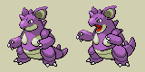
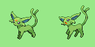

# Invidiually-Unique Pokémon Colors (+ Improved Shiny Colors) for Pokémon Platinum

**This project is not yet fully functional!**

This Platinum hack aims to make it so each individual Pokémon has a slight color variation based on its personality value. This is inspired by a [similar feature](https://guidesmedia.ign.com/guides/9846/images/pikacolors.jpg) from the Pokémon Stadium games that does just this but based on the Pokémon's nickname. The ROM hack [Pokémon Polished Crystal](https://github.com/Rangi42/polishedcrystal) implements a very similar feature based on IV values. This implementation performs a hue shift on the Pokémon's palette on load.

Currently, the hack can only do a static hue shift (that is, not connected to the Pokémon's personality value). Also, in battles, at certain times, the Pokémon's palette will revert to the normal one for a short time. Any help on either aspect would be much appreciated!

## Improved Shiny Colors

Some Pokémon have shiny colors that are very close to their non-shiny colors, or at least close enough that the simple hue shift performed by this hack may make a normal Pokémon look shiny. To remedy this, many Pokémon have been given revamped shiny colors. In additon, the opportunity has been taken to revamp Pokémon that seem to have obviously "bad" shiny palettes even if there's no ambiguity issue.

List of changed Pokémon (so far):

**Nidoqueen** - Colors made to look like Nidoking, which matches the pattern set by all other members of the Nidoran lines.

 

**Haunter, Gengar** - Tried to make a sensible gradient from Gastly to Mega Gengar (purple -> white with blue highlights).

**Scyther** - Made to be red-orange, which makes shiny Scyther and Scizor effectively be a loose swap of their normal colors.

**Articuno** - Lavender.

**Zapdos** - Brown.

**Espeon** - Less overly saturated.

**Magcargo** - Lava part matches shiny Slugma.

**Combusken** - Changed to match the color change made in Sword/Shield.

  

**Elekid, Electabuzz, Electivire** - Light blue, with Elekid being slightly more Cyan. Electivire has gold tips.

  

**Piplup, Prinplup, Empoleon** - Based off of [this post](https://imgur.com/t/shinypokemon/LMnl0Jx) from cjgart2000. Intended to give the "emporer penguin" look.

 

**Gabite, Garchomp** - Tried to make them consistent with shiny Gible (deeper blue, yellow/orange belly).

**Dusknoir** - Red to match shiny Duskull and Dusclops.

## Building

1. Install a [D compiler](https://dlang.org/download.html).
2. Use a program like Nitro Explorer 3 to extract `arm9.bin` from your Platinum ROM.
3. Place it in the root folder of this repo, and name it `arm9_vanilla.bin`
4. Run `./build.sh`.
5. Inject `arm9_patched.bin` back into `arm9.bin`.
6. Extract `pl_pokegra.narc`.
7. For each image in the `ShinyChanges` folder, insert that image to the proper place using "Pokemon Ds/Pic Platinum". (Note that some Pokémon might have changes to the base sprite.)
8. If you want to be really thorough, extract `pokegra.narc` and replace each changed palette entry (only the palette ones, not the image ones!).

## Credits

* MKHT - Help choosing shiny colors.
* cjgart2000 - [This post](https://imgur.com/t/shinypokemon/LMnl0Jx) inspired some of the new shiny colors.